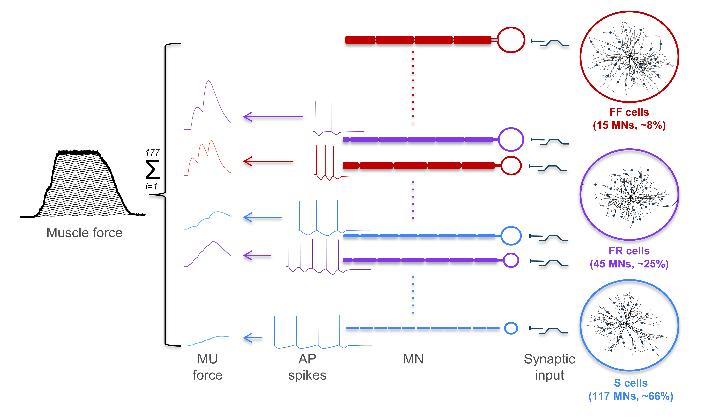
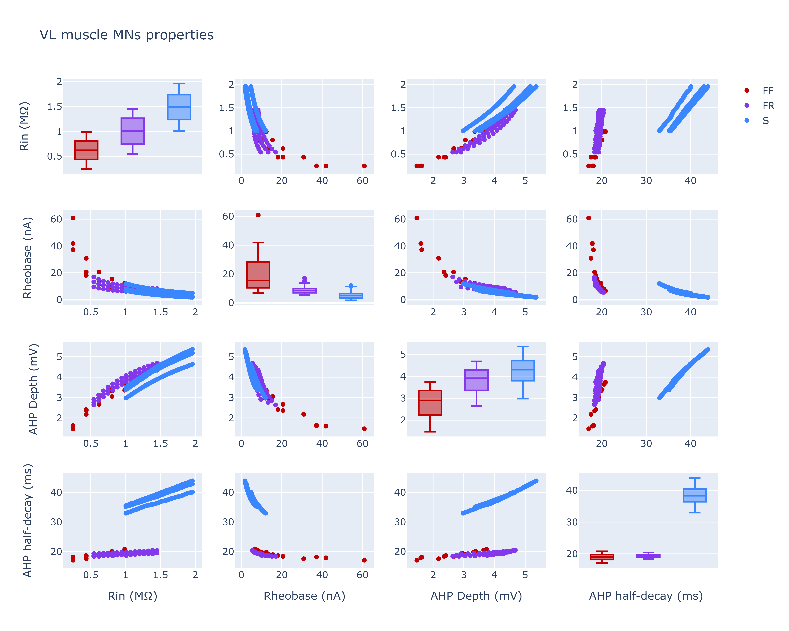
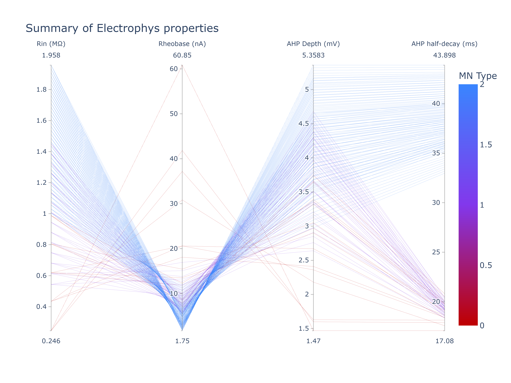

# Morphologically detailed motoneuron-pool
Morphologically detailed motoneuron pool for the vastus lateralis muscle. the model is composed on three cell types: fast fatigable (FF), slow (S), and fast fatigue resistant (FR). The model is based on the [Hodgkin-Huxley model](https://en.wikipedia.org/wiki/Hodgkin%E2%80%93Huxley_model) with some modifications to the active channels and dendritic mechanisms.

The model is based on [Allen & Elbasiouny (2018)](https://iopscience.iop.org/article/10.1088/1741-2552/aa9db5)

<span style="display: block; margin-left: auto; margin-right: auto; width: 80%;"></span>  

<span style="font-size: 14px; display: block; margin-left: auto; margin-right: auto; width: 90%;">Model schematic showing three distinct cell types (S, FR, FF). model can be stimulated with somatic currents or synaptic pulses. the generated spikes times are saved in output files, where is can be used to generate the force of each motor unit.</span>  

### Cells classes:
| Cell Type | Cell Type Code |
| --- | --- |
| FF | 30 , 3 , 300|
| FR | 20, 2, 200 |
| S | 10, 1, 100 |


## Requirments:
1. Requires Python3 (Anaconda package is recommended)
2. Install the [NEURON simulator](https://neuron.yale.edu/neuron/what_is_neuron)
3. Install the packages: numpy, mpi4py

## Files/folders description
| File/folder | Description |
| --- | --- |
| Simulation #1-8 | Contain .dat and .txt files for the spike times of each MU. The .dat files are used to generate the force vectors |
| Simulations data of panels C & D.xlsx | Excel files contains the summary data of all simulations presented in figures 3-8 panels C & D |
| forceGen.py | Contains the force generation functions |


## How to generate the force of each motor unit:
### From the command line:
1. Run the simulation using the following command:
          
      ```python -i forceGen.py```
2. force file for each motor unit will be generated in the same f
<br>


## Biophysical properties of the model:
<span style="display: block; margin-left: auto; margin-right: auto; width: 70%;"></span>  

<span style="font-size: 16px; display: block; margin-left: auto; margin-right: auto; width: 80%;">Scatter matrix for the model input resistance, Rheobase, AHP depth, and AHP half-decay.</span>  


<span style="display: block; margin-left: auto; margin-right: auto; width: 70%;"></span> 

<span style="font-size: 16px; display: block; margin-left: auto; margin-right: auto; width: 80%;">parallel coordinates visual for the model input resistance, Rheobase, AHP depth, and AHP half-decay.</span> 


<!-- ## Published article
* [JNP Article](https://journals.physiology.org/doi/full/10.1152/jn.00543.2020)

[](https://zenodo.org/badge/latestdoi/293670752) -->